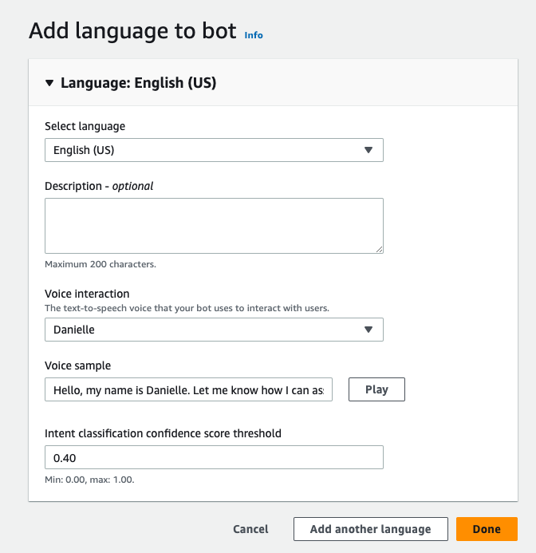
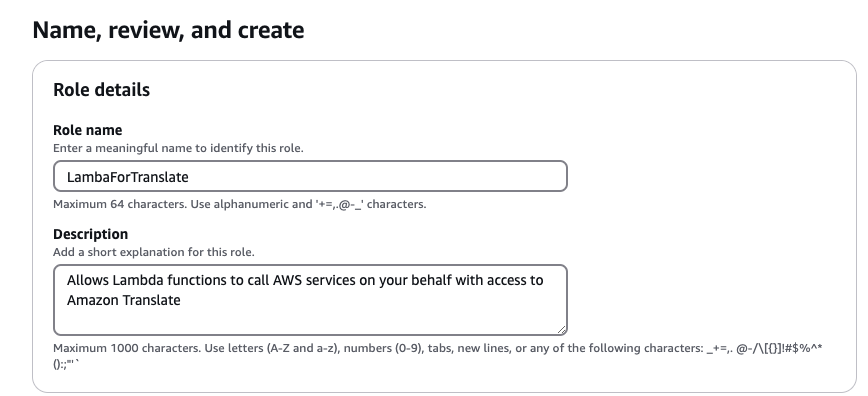
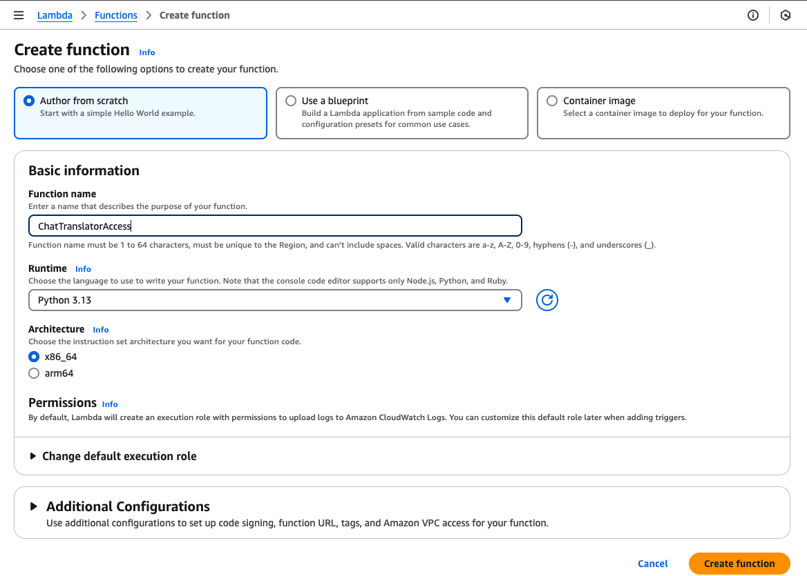
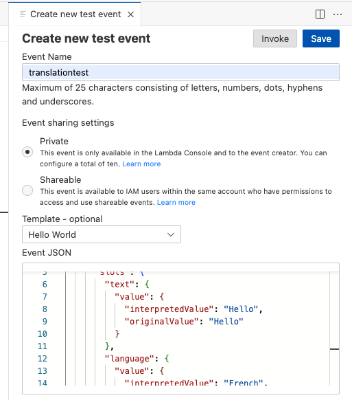
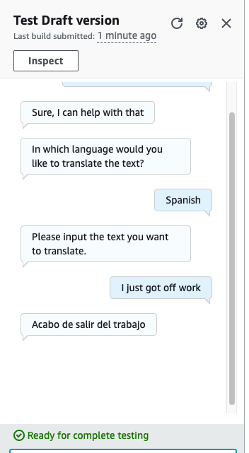

# Building a Language Translation Bot with Amazon Lex
## Objective
The objective of this project is to develop a language translation bot. With so many translation tools already available to the public, you might wonder—why create another one?The key advantage of a custom translation bot lies in its ability to serve specific business needs. Unlike generic translation services, a personalized bot can be tailored to reflect a company’s unique requirements, industry-specific terminology, and preferred languages. Additionally, it enhances data security by keeping sensitive information within a controlled environment, reducing reliance on third-party services that may store or process data externally.
## Project Sequence
- Creating an empty chatbot
- Specifying intents and slots
- Specify Fulfilment
- Create an IAM role
- Create a Lambda function
- Test the Lambda function
- Test the chatbot
## Architecture Diagram

## Step 1:Create the Chatbot in Amazon Lex
- In the Amazon Lex console, select "Create bot".
- Choose Traditional / Create a blank bot
- Name the bot and select the first option for IAM permissions. Choose "No" for COPPA.
Set English as the language and keep default settings. This completes the creation of an empty chatbot.

## Step 2: Configure the Bot for Translation
-Define the bot’s Intent, which represents its function. Since this bot translates text, name the intent "translatorintent"
- Set up Slots to process translation requests: ‍Create a slot type outside the Intent console, listing the languages the bot will translate to.
Inside the Intent editor, add the slot type and a prompt asking for the target language.
Add a second slot to capture the text input for translation.
- Optionally, set an initial response
- Define fulfillment outputs for success or failure
- Enable the Lambda function for processing
- Add a closing response to finalize the intent
- Add an Utterance, which acts as a key phrase that triggers the chatbot.
## Step 3: Create an IAM Role for Lambda Execution
- In the IAM console, create a new role for the Lambda service
- Attach the following policies: TranslateFullAccess, AWSLambdaBasicExecutionRole
- Name, review, and create the role.
  
## Step 4: Create and Configure the Lambda Function 
- In the AWS Lambda console, create a new function and attach the IAM role created earlier.
- set the runtime to Python 3.13.
   
- Edit the Lambda function code to process translations.
- Deploy and test the Lambda function:Configure a Test Event.Run the test to ensure it succeeds.
  
  ## Step 5: Integrate and Test the Chatbot
  - In the Amazon Lex console, build the Intent
  - Under Testing settings, add the Lambda function created earlier.
  - Test the chatbot by interacting with it.
    
 
