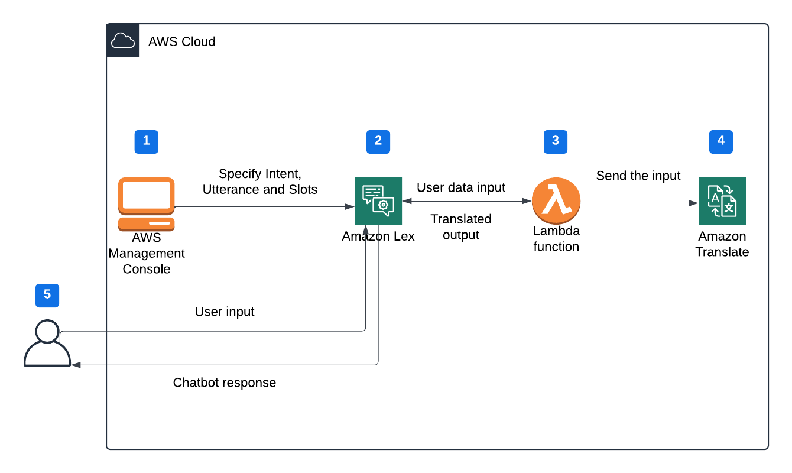

# Building a Language Translation Bot with Amazon Lex
## Objective
The objective of this project is to develop a language translation bot. With so many translation tools already available to the public, you might wonder—why create another one?The key advantage of a custom translation bot lies in its ability to serve specific business needs. Unlike generic translation services, a personalized bot can be tailored to reflect a company’s unique requirements, industry-specific terminology, and preferred languages. Additionally, it enhances data security by keeping sensitive information within a controlled environment, reducing reliance on third-party services that may store or process data externally.
## Project Sequence
- Creating an empty chatbot
- Specifying intents and slots
- Specify Fulfilment
- Create an IAM role
- Create a Lambda function
- Test the Lambda function
- Test the chatbot
## Architecture Diagram

